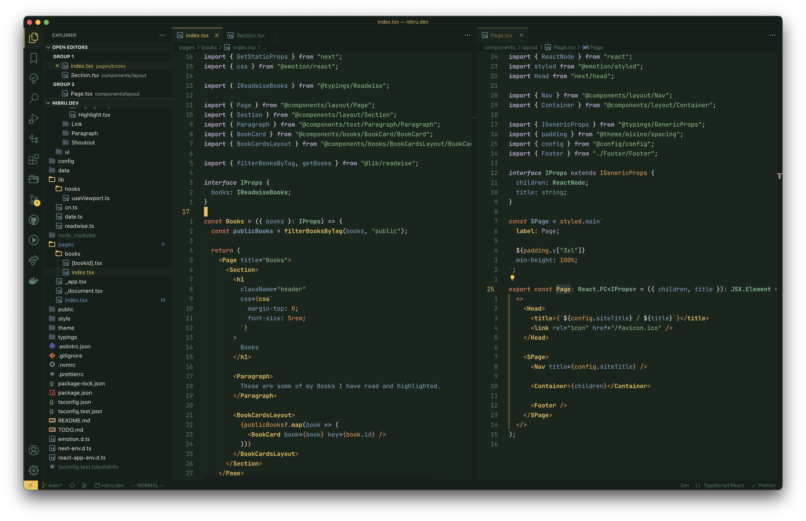
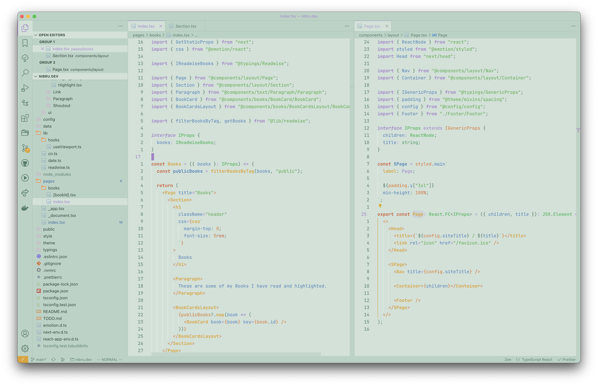
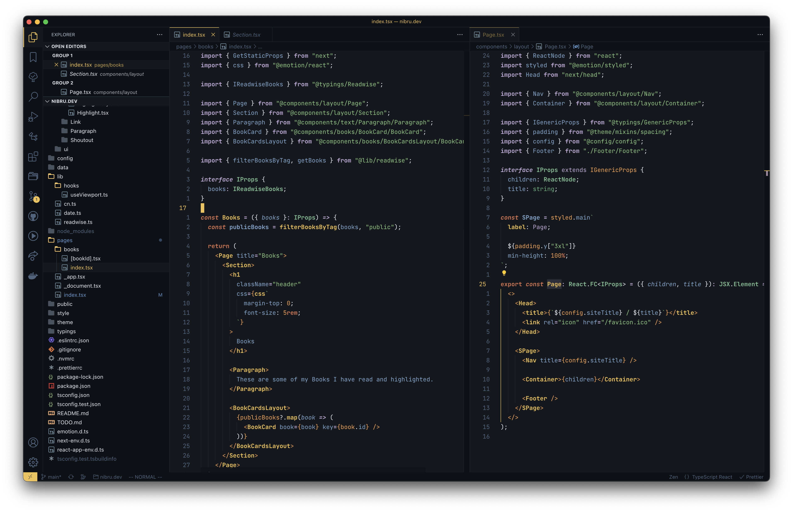
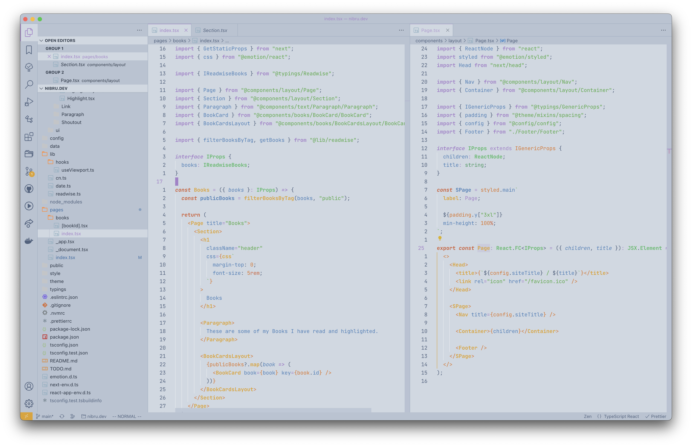

# Terra Theme for Visual Studio Code

Terra is a multi-platform color scheme collection, inspired by nature and their seasons, with a day and night variant.

## 🚧 &nbsp;Status: Early development &nbsp;🚧

This theme is in an early development phase.

When I am finished with the VSCode variant for the theme, I will continue to work on [Neovim](https://github.com/terra-theme/nvim), Obsidian and [Terminal](https://github.com/terra-theme/terminal) variants.

## Themes

-   [x] Spring
-   [x] Summer
-   [ ] Fall
-   [ ] Winter

## Screenshots

### Spring Night

### Spring Day

### Summer Night

### Summer Day

)
